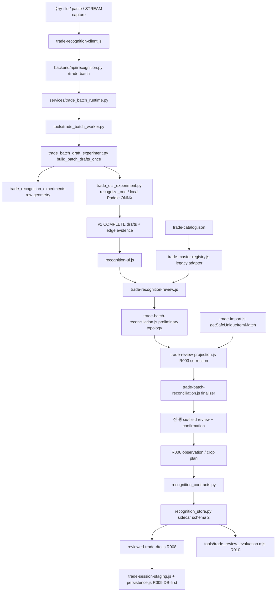

# 통합 인식 아키텍처 — ARCH-RESET-01

기준: 2026-10-01, `v2` / `1e178e831ae73ef16d0a0248bbb2d683fadb7259`.
이 문서는 정적 코드 조사와 Product Owner의 새 결정이다. **현재**는 조사된 구현, **목표/계획**은 미구현 계약이다. 문서 갱신으로 runtime, Master, 저장된 evidence, DB, OCR 모델이 바뀌지 않는다.

## 1. 현재 의존성 그래프



경로는 `_dev/local_app/` 기준이다. 현재 worker는 Master 없이 raw 후보를 만들며 이름과 숫자에 같은 local Korean OCR reader를 사용한다. JavaScript correction이 후보 보정의 authority다. Python `trade_ocr_experiment.py`의 catalog 후보 helper에는 유사 규칙이 있지만 live worker에서 두 번째 Master 보정으로 호출하는 경로는 아니다. 수동 JSON importer는 별도 호환 입력이다. 새 인식 경로에서 `processParsedTrades()` 전체를 호출하지 않는다.

현재 projection은 v1(reconciliation=null) 또는 v2(source/logical ledger 포함)다. `MATCHED`는 후보 상태이며 `FINAL_READY` 판정이 아니다. Review UI는 전 logical row의 여섯 편집 필드와 전체 확인을 요구한다. R006 completion/observation은 v1, R010은 이 계약의 human-declared field를 평가한다. 현 R010 raw 이름 비교는 normalizedText를 우선하므로 새 RAW_EXACT와 같은 기준이라고 주장하지 않는다.

## 2. Master inventory와 준비 상태

| 현재 source/view | 수치·상태 | authority 의미 |
|---|---|---|
| `frontend/data/trade-catalog.json` | source occurrences 241 | legacy source fact |
| master items | 118, tier1–5 각14, tier6–7 각24 | owner curation 미완료 |
| special items | 9 | 현재 kind SPECIAL_ITEM, 향후 ITEM category로 명시 변환 |
| island source scopes | GENERAL 100 / T6 8 / T7 6 | scope membership과 identity는 별개 |
| exact legacy-name records | 230 = master118 + special9 + island103 | scope overlap11을 묶어도241 원본 위치 보존 |
| stable entities / stableId coverage | 0 / 230 records 중0 | runtime `curatedMappings:null` |
| unresolved mappings | 230 | 후보로 사용 가능, 검증된 authority 아님 |
| curated verified display names / aliases | 0 / 0 | near-name7쌍은 같은 identity의 증거 아님 |
| `reference/barter_items.json` | Warehouse reference70, tier1–5 각14 | Trade Master에 자동 이식 금지 |
| reference name metadata | program/official/display 각70, alias1 | 과거 source metadata이며 현재 owner 승인 아님 |
| reference screen flag | true56 / 기타14 | actualScreenVerified를 VERIFIED_CURATED로 자동 승격 금지 |

catalog raw SHA-256: `8183b03e6aa0ee354142cf9720b401494bec365e528632f3c0c84ec11b46b4b3`.
Reference alias1은 `롬타스 그물`에 연결된 `롭타스 그물` 기록이다. 새 Master verified alias로 간주하지 않는다. 현재 runtime에는 curated disputed entity도 없다. canonical/display/alias 분리 schema support는 있지만 실catalog의 authority data는 입력되지 않았다.

**판정:** curation seed는 준비되어 있고 correction 정본의 owner 검증은 미완료다. Trade118+9와 Warehouse70을187 unique items로 합산하지 않는다. stableId를 이름/index/locator/hash에서 만들지 않는다. `하코번 섬 / 하코번`, `일리야 / 일리야 섬`의 동일성은 자동 판정하지 않는다.

## 3. V1 correction inventory

V1 baseline의 `frontend/js/domain/trade-import.js`와 현재 파일은 CRLF→LF만 정규화한 비교에서 동일하다. 양쪽 normalized SHA-256은 `e033ca0e41791626770f4c767dc1de7adf41bfd5d1943ca90a2bb254348d7e2f`다. 이 파일에서 조사한 rule군의 source 유실은0이다. 조사하지 않은 과거 실험 규칙까지 유실0이라고 주장하지 않는다.

| rule | 현재 위치·사용 | 분류와 새 pipeline 처리 |
|---|---|---|
| whitespace compact, 단계prefix, xN 정리(manual 전역 / V2 suffix) | manual importer / R003 | 사용 중·V2 흡수됨. Stage1로 일원화하고 raw 보존 |
| exact item / bounded unique | getSafeUniqueItemMatch, R003 import | 사용 중·V2 흡수됨. similarity≥0.75, 거리bound, 유일 후보 유지 |
| toItem 선행, fromItem 이전tier pool | importer / R003 | 사용 중·V2 흡수됨. 검증된 tier relation을 Stage4에서 적용 |
| tier0→1 open-world input | importer / R003 | 사용 중·V2 흡수됨. 목록 밖 문자열을 강제 identity화하지 않음 |
| special substring / coin slot 판정 | importer getItemTier | legacy 사용 중. 새 authority는 curated category/mapping, substring에서 검증 사실 생성 금지 |
| 일반 섬 nearest distance≤3 | manual getBestMatch | legacy 사용 중. V2 island는 bounded unique로 대체됨 |
| T6/T7 island forceMatch | manual importer | 새 경로에 unsafe. scope 제한은 재사용, 강제 최근접은 제외 |
| identity-only duplicate / input conflict | importer | manual 호환 유지. V2는 R007 topology/exact6/conflict로 흡수 |
| req fallback1 / count fallback0 | manual importer | 새 경로에 unsafe. Stage5/DTO에서 호출 금지 |
| 같은 threshold Python catalog helper | experimental trade_ocr_experiment.py | 중복 구현 위치. live correction authority 아님, 새 batch에서 이중 실행 금지 |

수동 JSON과 V1 importer 기대값은 보존한다. 현재 V2 normalization/numeric/candidate 규칙을 새 모듈로 이전할 때 기존 경로는 legacy dispatcher 또는 wrapper로 남긴다. 같은 batch에 old/new 보정을 연속 적용하지 않는다. 기존 importer rule은 유실되거나 obsolete가 된 것이 아니라 manual 호환과 새 경로의 허용 범위가 다르다.

## 4. 숫자 경로와 현재 계약 gap

공통 reader: local `paddle-korean-ppocrv5-mobile-onnx-cpu-v1`, model `korean_PP-OCRv5_mobile_rec`, `onnxruntime`, CPU. worker는 `recognition-local/envs/t010b1-ocr/Scripts/python.exe` 별도 subprocess를 사용한다. app test용 Python314와 OCR worker 환경을 혼동하지 않는다. 이번에 engine 교체는 결정하지 않는다.

| field | selected row-relative lane x / y | 현재 parse / projection |
|---|---|---|
| reqAmount | .285–.34 / .41–.94 | raw ASCII 정수→rawNumericCandidate, JS minimum1 |
| count | .165–.28 / .45–.90 | raw ASCII 정수→rawNumericCandidate, JS minimum0, 실제0 보존 |
| yield | .66–.71 / .34–.95 | raw ASCII 정수→rawNumericCandidate, JS minimum1 |

좌표는 현재 selected profile의 조사값이며 품질 승인값이 아니다. `trade_batch_draft_experiment._field_record()`가 crop을 reader에 전달하고 strict ASCII `[0-9]+`를 parse한다. geometry 부적격이면 미실행, boundary contact이면 FIELD_CLIPPED, empty/error/invalid를 별도 기록한다. raw/score/cropHash를 보존하며 numeric structure reader는 형태·경계 진단을 추가한다. count의 observed1–10은 진단이며 상한 authority가 아니다.

JS `trade-review-projection.js`는 rawNumericCandidate를 우선하고, 없으면 허용 decoration/comma를 처리하는 별도 parser를 사용한다. req/yield에 NUMERIC_COMPLETENESS_UNVERIFIED risk가 붙는다. 이 후보가 정답으로 승격된 것은 아니지만 reader/parse 불일치를 통합 resolution 계약으로 다루지 못한다.

**정적 계약 gap:** worker geometry.box는 normalized `{x0,x1,y0,y1}`, review cropBox/captureGeometry는 pixel `{x,y,width,height}`를 요구한다. reader cropHash는 draft top-level/visual에 있지만 C2 plan은 readerEvidence.cropHash를 읽는다. 이 shape에서 field crop이 제공되지 않는 경로가 있다. rowBox에 기반한 row crop까지 모두 불가능하다고 단정하지 않는다. 이번에 live 재현/OCR 실행은 하지 않았다. U2/O1은 실제 worker shape를 fixture로 고정해 계약을 보정해야 한다. 관측된 모든 숫자 오답의 원인을 이 gap으로 단정하지 않는다.

## 5. 새 canonical pipeline

```mermaid
flowchart LR
  C[수동capture] --> D[row / field geometry]
  D --> O[0 RAW_OBSERVATION]
  O --> N[1 NORMALIZATION]
  N --> M[2 MASTER_EXACT]
  M --> B[3 BOUNDED_CORRECTION]
  B --> Q[4 DOMAIN_CORRECTION]
  Q --> X[5 NUMERIC_RESOLUTION]
  X --> R[6 RECONCILIATION]
  R --> V[7 FINAL_VALIDATION]
  V --> F[8 CLASSIFICATION]
  F --> W[문제행 검수 / 전체 최종결과]
  W --> E[한 번의 batch confirmation / immutable evidence]
  E --> DTO[R008 vNext DTO safety]
  DTO --> S[R009 DB-first staged session]
```



단일 pure JavaScript domain orchestrator가 Stage1–8을 소유한다. Python worker는 Stage0 observations/geometry만 생성한다. backend는 schema/hash/lineage/confirmation을 검증하며 별도 fuzzy 보정을 실행하지 않는다. UI는 final value와 human override를 표시한다. 이름/숫자 reader가 다른 engine이어도 correction authority는 하나다.

예정 public contract:

```js
buildFinalTradeProjection({
  rawObservation, registrySnapshot, correctionPolicy,
  reconciliationPolicyVersion, pixelAvailability
}) // pure sync semantic object; hashing wrapper는 분리
```

입력은 immutable JSON이다. time/random/DOM/network에 의존하지 않는다. Raw/projection semantic hash는 timestamps·latency·실행기 absolute path를 제외하고 source/geometry/reader output·versions를 포함하며, audit envelope hash는 저장된 audit metadata까지 포함한다. registryVersion/hash, raw hash, reader/profile/policy version, crop availability facts를 pin한다. 재보정은 명시적 새 revision/hash를 만들고 옛 projection을 보존하며 옛 confirmation을 무효화한다. UI mount가 최신 Master로 조용히 바꾸지 않는다.

| stage | 입력→출력 및 보존 계약 |
|---|---|
| 0 RAW_OBSERVATION | source/bitmap hashes, frame/fidelity, ordered sourceRows, row/field CropRef, rawText/numeric candidate, reader/version/confidence/errors. edge는 별도 |
| 1 NORMALIZATION | versioned whitelist의 Unicode/space/알려진 decoration 정리. 이름/숫자 규칙 분리, raw 불변. 알 수 없는 punctuation·복수 숫자를 삭제해 정답화 금지 |
| 2 MASTER_EXACT_MATCH | pinned verified canonical/display/alias. legacy exact는 후보로 남기되 authority 분리, kind/tier/collision 보존 |
| 3 MASTER_BOUNDED_CORRECTION | 현0.75·거리bound·unique 조건 유지. verified pool, qualified alternatives, 적용rule 기록. ambiguous는 selected=null |
| 4 DOMAIN_CORRECTION | toItem identity/tier→from pool→island scope 의존 순서. Master에 있는 관계만 적용, open-world0→1 보존. pool 재제한 시 같은 pipeline의 Stage2/3 helper 재사용, 같은 값 이중 보정 금지 |
| 5 NUMERIC_RESOLUTION | strict safe integer, field별 decoration, crop completeness, reader/parse conflict. req/yield≥1, count≥0. null/value 충돌 보존, defaults·Master 숫자 추측 금지 |
| 6 MULTI_CAPTURE_RECONCILIATION | R007 topology/finalizer 재사용. 인접 different-image suffix/prefix≥2, strong rowCropHash boundary1 허용, same-image ordinal 예외. source ledger exactly once |
| 7 FINAL_ROW_VALIDATION | six slots, identity/legacy scheduler mapping, numeric, geometry/lineage, domain/input conflicts, row completeness. unknown DTO 금지 |
| 8 FINAL_CLASSIFICATION | 전체 logical rows와 edge work items accounting, 이유가 있는 상태. READY는 후보 완결성이지 human truth/autoaccept가 아님 |

예정 field trace:

```js
{
  raw: { text, numericCandidate, readerRef, cropRef, sourceRefs },
  normalized: { value, policyVersion, appliedRules },
  masterMatches: [], correctionCandidates: [], selectedCandidate: null,
  correctionReasons: [], riskReasons: [],
  finalValue: null, finalStatus: "UNRESOLVED", stageTrace: []
}
```

trace entry는 stage/rule/version, input/output, rejection, alternatives/sourceRefs를 보존한다. raw/normalized/selected/human final을 구분한다. null은 미실행·실패·empty·abstention reason과 함께 기록한다. field resolved/unknown/conflict와 row 분류 enum은 별개다.

## 6. 최종 분류와 사용자 결정

우선순위: **CONFLICT → NEEDS_RECAPTURE → NEEDS_REVIEW → FINAL_READY**. 복수 사유는 모두 보존한다. edge는 fake COMPLETE row가 아니라 capture 위치가 있는 recapture work item이다.

| state | 의미 / 후속 행동 |
|---|---|
| FINAL_READY | six slots, valid numeric, verified/resolved identities 또는 명시 human open-world resolution, legacy mapping 가능, 미해결 conflict 없음, domain valid, source ledger와 row/critical field pixels 접근 가능, 모든 policy check 통과. MATCHED/high score만으로 부족 |
| NEEDS_REVIEW | legacy-only/unmatched/ambiguous name, Master disagreement, numeric missing/invalid/suspicious, 미승인 reader quality, 확인 불충분한 lineage. 원본을 읽어 human resolution 가능한 문제 |
| NEEDS_RECAPTURE | clipped/partial row, geometry 부족, critical crop pixels 없음. 다시 캡처할 위치 안내, six blanks 강제 입력 금지 |
| CONFLICT | correction/readers/reconciliation/domain의 미해결 값·identity 충돌. 자동 선택 없이 source 값/crops와 명시 human 결정을 요구 |

stableId null이어도 후보·행을 제거하지 않는다. legacy 이름이 exact라는 이유로 무조건 READY로 두지 않는다. open-world input을 원본으로 확인해 exact name을 채택하면 DTO에 사용 가능하지만 Master entity를 자동 생성하지 않는다. bounded unique도 검증 pool에서 고른 candidate이며 truth가 아니다.

numeric quality policy에는 reader/version, geometry completeness, parse/conflict, 평가 승인 여부를 명시한다. completeness risk를 삭제해 READY 수만 올리지 않는다. 미검증 reader를 전부 review로 두었다는 이유로 usability 성공을 선언하지 않는다. O3/O4 이후 freeze한 policy와 독립 평가에서 ready율·오답·수정 부담을 함께 검증한다.

문제 처리: 수정, UNKNOWN, 명시 제외, 재capture. 제외 사유와 coverage를 보존한다. 재capture는 옛 source를 삭제하지 않고 새 revision으로 연결한다. unresolved row는 session에 적용하지 않는다. batch 확인은 active/excluded/unknown/edge dispositions를 포함한 전체 row set에 한 번 bind한다.

## 7. Master curation과 immutable bundle

제품 내부 전용 **마스터 관리** 화면에서 Item/Island를 분리한다. canonical은 내부 대표명, display는 게임 표시명, aliases는 승인 관계다. legacy/deprecated names, status/provenance, Item tier/category를 분리한다. 기존 MASTER_ITEM/SPECIAL_ITEM은 명시 adapter로 ITEM+category에 옮기며 원kind/locators를 보존한다.

Master bundle schemaVersion **2** 예정. R002 snapshot v1은 read adapter로 유지한다. legacy source와 연결되지 않은 curated entity도 새 canonical model/pool에서 빠뜨리지 않는다.

```js
{
  schemaVersion: 2, registryVersion, createdAt,
  entities: [{ stableId, kind, canonicalName, displayNames, aliases,
    legacyNames, tier, category, status, provenance, replacedBy }],
  compatibilityMappings: [], unresolvedLegacyNames: [],
  sourceRevisions: [], provenance: {}, hashBasis: "MASTER_CANONICAL_JSON_V2", contentHash
}
```

status: LEGACY_UNVERIFIED / VERIFIED_CURATED / DISPUTED / DEPRECATED. 이름/alias별 authority를 따로 기록한다. entity verified가 모든 alias를 verified로 만들지 않는다. 옛 VERIFIED를 새 owner save 없이 VERIFIED_CURATED로 자동 변환하지 않는다. opaque stableId는 owner가 새 entity를 승인하는 save transaction에서 UUID로 한 번 발급하며 기존ID 변경은 금지한다. near-name merge는 명시 curation/replacedBy와 이력이 필요하다.

M3에서 **전용 Master SQLite store schema1**을 계획한다. Main/user/session DB와 recognition sidecar에 혼재시키지 않는다. immutable bundle JSON/contentHash, active pointer, mutation receipt를 한 transaction으로 publish하는 최소store다. app API의 명시 owner 확인만 save한다. expected registryVersion CAS, same mutation/same body retry, 다른body conflict, rollback/backup/export를 검증한다. 이번에는 store 생성·접근 없음.

contentHash는 createdAt/registryVersion/contentHash를 제외한 전체 semantic 내용이며 source revisions/provenance를 포함한다. 고정 ASCII schema keys를 ordinal sort하고 이름은 key가 아닌 value/array에 저장한다. UTF-8, string 임의 정규화 금지, JSON safe integer만 허용, duplicate keys/NaN/float/-0 거부. JS/Python golden vectors로 일치를 확인한다. `registry-v2:<contentHash>`이며 시간만 다른 semantic duplicate save는 기존bundle/version을 반환한다. createdAt은 audit metadata다.

batch 시작 시 immutable bundle을 읽고 검증해 version/hash를 pin한다. save된 Master는 **다음 batch**부터 적용한다. 현재 batch는 사용자가 새 Master로 재보정을 선택한 경우만 새projection revision을 만든다. 미저장 human edit를 지우지 않으며 carry-forward는 source 일치와 명시 재확인이 필요하다.

OCR/Review는 **MASTER_CURATION_PROPOSAL**만 생성한다. observed text/source crop hash/옛registry reference/reason, 승인·거절 이력을 보존한다. proposal 저장으로 alias/tier/identity/activebundle을 변경하지 않는다. crop label truth와 Master 관계 승인도 분리한다.

## 8. 검수 workspace와 pixels

전용 검수 창 header: capture 수 / source COMPLETE 수 / logical final 수 / 4가지 상태 수. tabs: **문제 행(default) / 전체 최종 결과 / 원본·OCR / Master 제안**. READY는 compact하지만 모든 행에 접근 가능하다. 문제 선택 시 row crop 옆에 final6 값을 크게 표시한다. field crop, full capture 위치, conflict source 비교를 직접 열 수 있다. JSON/IDs/diagnostic은 ‘왜 이렇게 보정됐나’에 접는다.

예정 CropRef:

```js
{ captureId, bitmapSha256, frame: { width, height },
  coordinateSpace: "CAPTURE_BITMAP_PIXELS", box: { x, y, width, height },
  pixelHashBasis: "RGB8_ROW_MAJOR_V1", pixelSha256,
  pngArtifactSha256: null, availability: "IN_MEMORY", geometryProfileRef }
```

box는 decoded capture bitmap의 bounds 내 정수 좌표다. row-local field box를 capture 좌표로 명시 변환한다. normalized lane을 pixel box로 위장하지 않는다. resize/DPR은 표시 transform이며 crop extraction은 source bitmap에서 lossless로 한다. worker pixel hash와 encoded PNG raw-byte hash는 별개다. canonical RGB bytes/dimensions hash basis를 고정하며 PNG hash와 같다고 검사하지 않는다. 옛 rowCropHash basis는 version dispatch하고 새pixelbasis와 맹목 비교하지 않는다.

Blob cache와 serialized availability evidence를 분리한다. cache 만료/close/reload로 pixels를 잃으면 ‘원본 확인 불가’를 표시하고 새availability revision에서 READY를 취소한다. hash 존재만으로 pixels 존재를 주장하지 않는다. full screenshot 영구 저장은 필요 없다. 선택 field/row crop subset에 budget/retention/export 정책을 적용한다.

multi-source row는 earliest representative와 전member geometry/trace/sourceRefs를 유지한다. conflict 비교는 각 source crop을 사용한다. durable crop은 대표 selected crop subset을 우선 유지하며 multi-source durable 확장은 별도 Task다. 저장하지 않은 source evidence와 불가 이유도 잃지 않는다.

## 9. Evidence/DTO/version compatibility

목표: **FinalProjection3 / FinalCompletion3 / TradeReviewObservation3 / export envelope3**, reviewMode `FINAL_CORRECTED_RESULT`. planned raw draftv2는 O1/U2 adapter 계약이며 live producer 전환는 E1 통합gate 이후다. 옛 draftv1, projectionv1/v2, completion/observation/exportv1은 read/export/hash를 별도 dispatch한다. 기존 payload 자동 rewrite/relabel 금지.

confirmation은 batchId/projectionHash/rawObservationHash, registryVersion/contentHash, reader/profile/correction/classifier versions, reviewRevision, 전체logical IDs/source mapping, edge/exclusion dispositions, human final values에 bind한다. rowset/hash/version 변경은 stale다. partial confirmation, future version, unknown/duplicate row, source spoofing, count mismatch, receipt 불일치를 거부한다.

field decision: **CANDIDATE_RETAINED / USER_EDITED / USER_MARKED_UNKNOWN**. batch scope: **USER_FINAL_LIST_CONFIRMED**. CANDIDATE_RETAINED는 각crop을 독립 확인한 truth가 아니다. benchmark truth는 별도 **HUMAN_CROP_VERIFIED** label/provenance다. edit만으로 crop 전체문자 검증을 추정하지 않는다. 옛 USER_BATCH_CONFIRMED_UNCHANGED 의미를 새retained records에 재사용하지 않는다.

현재R006 tables는 schema_version=1, confirmationRevision=1, verificationMethod3종 CHECK를 갖는다. JSON 확장만으로 새의미 저장이 불가능하다. E1은 **recognition sidecar DB schema3**의 additive vNext observation/artifact/receipt tables를 계획한다. v2 tables/JSON/artifact bytes/hash는 보존하고 backup→transactional migration, 실패rollback/future schema 거부를 검증한다. contracts/store/API 변경은 E1 명시scope다. Main schema3는 바꾸지 않는다.

옛 PY_CANONICAL_JSON_V1/observationHash는 불변이다. vNext는 canonical JSON primitive를 재사용할 수 있지만 새schema/method 내용은 별record/hash다. projection hash는 stage evidence/source mapping/Master·policy·availability binding을 포함한다. mapping만 달라도 hash가 달라진다. cross-language vectors, semantic/audit hash 구분, read/export tamper 검사를 E1에서 고정한다.

R008 safety를 new envelope adapter로 유지한다: six valid final values, explicit legacy mapping, source coverage, conflict/unknown 불가, explicit exclusions, receipt/hash/stale 검사. 마지막 mapping이 다시fuzzy해 displayed value를 바꾸지 않는다. R009 NEW/APPEND intent, revision/mutation, DB-first commit→readback→local apply→render/reload를 유지한다. evidence save와 session commit은 별transaction이며 실패 상태를 분리한다.

## 10. OCR adapter와 교체 gate

예정 `recognizeTextCrop(crop, context)` / `recognizeNumericCrop(crop, context)`. context: CropRef/field/reader/profile versions/timeout/local resource policy. output: raw text/value proposals/confidence/error/latency/reader ID/source binding. Master 접근 없음. CURRENT_ENGINE을 먼저 wrap한다. fallback/ensemble이면 모든 reader candidate를 남기며 다수결·고score만으로 conflict를 삭제하지 않는다.

O2 dataset은 owner가 실제 crop을 확인한 label만 정답으로 쓴다. island/fromItem/toItem/reqAmount/count/yield, capture environment/source/frame hashes, pixel/PNG basis, truth status/label revision/provenance/source-family group/split을 고정한다. Master나 최종 후보를 truth로 복사하거나 label 입력의 정답으로 prefill하지 않는다. unverified/disputed는 accuracy에서 제외하되 coverage에 보고한다.

O3 CURRENT/candidates는 **같은 crop/hash/split**으로 비교한다. train/development에서 후보·threshold를 결정하고 independent evaluation은 사전freeze 이후 소비한다. 같은 source/session/bitmap은 같은 splitgroup이다. raw text exact, normalized exact(별policy), numeric exact, empty, wrong-confident, latency p50/p95/resource를 field별 보고한다. 미교정score에 공통confidence threshold를 임의 적용하지 않는다.

evaluation을 보기 전에 실질 개선 최소치, wrong-confident non-regression margin, confidence calibration/threshold, latency/resource budget, unknown coverage, minimum sample, paired uncertainty criterion, rollback reference를 freeze한다. 지금 근거 없는 숫자를 발명하지 않는다. **O3 사전계획에서 owner가 수치gate를 승인**해야 한다. 평가 후 바꾼 후보는development로 돌아가고 새holdout이 필요하다.

text/numeric 별engine을 허용한다. 독립data에서 실질 개선, wrong-confident 악화 없음, local runtime/resource 적합, crop/contract 회귀 PASS일 때만 O4 제한채택한다. 근거 없으면current를 유지한다. 이번에 특정library/candidate나 개선 성능을 추측하지 않는다.

## 11. 평가 세 층과 분모

새evaluation schema/policy를 지정하고 옛R010 report는 변경 없이 읽는다. 옛F=6R, V=human-declared known fields, R=logical reviewed rows, T=six known truth/mapping rows다. 새retained fields를 옛V에 더하지 않는다.

새분모: S=source COMPLETE, R=전체 final logical rows, F=6R, V=**독립human crop label이 known인 fields**, T=전6label known인 rows. edge E는 별도. B=confirmed batch fields는 동작 coverage이지V가 아니다. missing/abstain/unknown/exclusion을 제거해 정확도를 꾸미지 않는다.

| metric | 정의 |
|---|---|
| RAW_NAME_EXACT / RAW_NUMERIC_EXACT | raw가 독립label과 일치 / 해당known crop fields, missing은 오답 |
| NORMALIZED_EXACT | 고정normalization 후 일치 / 동일known fields, raw exact와 별개 |
| NAME_CORRECTION_RECOVERY / HARM | rawwrong→finalcorrect / rawwrong known names; rawcorrect→finalwrong/missing / rawcorrect known names |
| FINAL_FIELD_ACCURACY / six-field exact | human edit 전 fully corrected candidate 일치 / V; 전6일치 / T |
| FULLY_CORRECTED_ROW_READY_RATE | human edit 전 FINAL_READY / R, 상태판정불가도 분모 유지 |
| NEEDS_REVIEW / NEEDS_RECAPTURE / CONFLICT RATE | 각primary state / R, edge E는 별도, 복수reason 내역도 보고 |
| USER_EDIT_RATE_AFTER_FULL_CORRECTION | frozen final candidate↔human final semantic edit fields / F; known resolved denominator도 병기 |
| NUMERIC_FAILURE_RATE | raw/final 각각missing/invalid/clipped/conflict slots / 3R; known-label wrong 별도 |
| MASTER_UNRESOLVED_RATE | 보정 후 unresolved identity slots / 3R; open-world/disagreement 내역 |
| UNHIGHLIGHTED_ERROR_RATE | READY이면서label상wrong / READY known-labeled fields; selection bias 표시 |
| FINAL DTO / session success | 전체R와explicit exclusion 제외R 둘다, unknown/held/edge/omission 및durable 결과 병기 |

READY의 정답이 자동 확보되는 것은 아니다. 정확도 평가에는 문제queue 밖READY도 별도의 독립crop labeling으로 확인해야 한다. 일반 사용자에게 매번전field review를 요구하는 것과 구분한다. 분모0=N/A, all-HOLD/error0은 usability PASS 아님. coverage/wrong-ready/user burden을 같이 판단한다.

## 12. Luna 구현 Task 명세 — 모두 planned

경로는 `_dev/local_app/` 기준, 신규는 **new**다. 각Task는 새 지시의base/scope를 확인하고 Luna High로 실행한다. 번호는 기존R007-C1 등과 별도 `ARCH-M1` namespace다. 큰storage/integration 작업은 아래substep별 별commit/검증으로 나눈다.

| Task / 의존 | 정확한 파일 scope | 계약과 필수 검증 |
|---|---|---|
| M1 / architecture 승인 | new frontend/js/domain/trade-master-bundle.js; new tests/trade_master_bundle_regression.mjs | schema2/hash/v1 read-only adapter, 241source/230legacy, noautoverify/autoID, kind/category, collision/lifecycle/replacedBy, Unicodehashvectors, freeze/immutability, 기존registry회귀 |
| M2 / M1 | new frontend/js/trade-master-ui.js; new frontend/css/trade-master.css; frontend/index.html; frontend/js/app.js; new tests/browser_trade_master.mjs | 앱내Item/Island draft editor/proposal/explicit confirmation, stableId read-only; M3 전save disabled/미저장표시, fakestore UI검증, currentbatch/OCR변경0 |
| M3a / M1 | new backend/master_store.py; new tests/backend/test_master_store.py | 전용schema1, atomicbundle/CAS/idempotency/rollback/backup, opaqueID explicitapproval/hashvectors, tempDB만 |
| M3b / M2,M3a | new backend/api/master.py; backend/app.py; frontend/js/trade-master-ui.js; tests/browser_trade_master.mjs; new tests/backend/test_master_api.py | localAPI auth/origin/limits, active/pinnedread/proposal/save/export, noautomutation, UIreceipt, currentbatchpin불변, Main/sidecar무변경 |
| C1 / M1 | new frontend/js/domain/trade-final-correction.js; new tests/trade_final_correction_regression.mjs | Stage0adapter+Stage1–8 interface/trace, puredeterministic/immutability, 기존R003 후보값 semantic parity부터(새authority/status 차이는 명시), runtime접속0 |
| C2 / C1,M3 | frontend/js/domain/trade-final-correction.js; frontend/js/domain/trade-review-projection.js; tests/trade_final_correction_regression.mjs; tests/trade_review_projection_regression.mjs | name/domain/numeric일원화, legacyschemadispatch, safeunique/island/open-world/disagreement, reader/parseconflict/0/no defaults, trade-import변경0/domain·import회귀 |
| C3 / C2 | new frontend/js/domain/trade-final-classification.js; frontend/js/domain/trade-final-correction.js; new tests/trade_final_classification_regression.mjs | finalprojection3, every sourceonce, R007reuse, 4state/reason/cropavailability, 6→4/null-valueconflict/no drop/legacyparity |
| O1 / C1 | new tools/trade_ocr_adapter.py; tools/trade_batch_draft_experiment.py; new tests/backend/test_trade_ocr_adapter.py | current text/numeric wrapper, raw/parse/geometry분리/noMaster, fakeunit+opt-inlocalcurrentparity, worker/client전환0/교체0 |
| U2a / O1,C3 | tools/trade_batch_draft_experiment.py; tools/trade_batch_worker.py; new tests/backend/test_trade_crop_contract.py | rawv2 CropRef, rowlocal→capturepixel, normalized lane분리, RGB/PNGbasis/bounds/edge/errors; legacyrawv1 option/실worker형태pixelsfixture |
| U2b / U2a | new frontend/js/trade-source-evidence.js; new tests/trade_source_evidence_regression.mjs | Blobcache/CropRefdecoder/source locate/display transform, pixel equivalence/expiration/hash mismatch/worker-shape검증, U1부품 |
| U1 / C3,U2b,M2 | new frontend/js/trade-final-review.js; new frontend/css/trade-final-review.css; frontend/index.html; new tests/browser_trade_final_review.mjs | 문제우선/allrows/crop옆6final/접힌diagnostics/conflictedit·unknown·exclusion/oneconfirm/stalehash/noautotruth, fakeintegration까지 |
| E1a / C3,U1 | backend/recognition_contracts.py; backend/recognition_store.py; tests/backend/test_recognition_store.py; tests/backend/test_trade_review_observations.py; new tests/backend/test_final_review_observations.py | sidecar3/additive migration/vNext, v1read-exportbyteshash보존, batchretained≠truth, sourceaccounting/realPillow/C2/idempotency/export, tempfailureinjection |
| E1b / E1a | frontend/js/domain/reviewed-trade-dto.js; frontend/js/trade-final-review.js; tests/reviewed_trade_dto_regression.mjs; tests/browser_trade_final_review.mjs | R008schema3adapter/receipt/legacymapping/no refuzzy/unknown-exclusion/confirmationbinding, R009staging회귀 |
| E1c / E1b,U2a | backend/api/recognition.py; backend/services/trade_batch_runtime.py; frontend/js/trade-recognition-client.js; frontend/js/recognition-ui.js; new tests/browser_trade_final_flow.mjs; tests/trade_recognition_client.mjs; tests/backend/test_trade_batch_api.py; tests/backend/test_trade_batch_runtime.py | explicitversionnegotiation/newUIactivation/rawdispatch/Masterpin/proposal/save→DTO→NEWdurable-readback-reload, sessionalgorithm불변; oldreview/batch/capture/persistence+newflow검증후activate |
| O2 / M3,U2,E1 | new tools/trade_crop_benchmark.mjs; new tests/trade_crop_benchmark_regression.mjs; frontend/js/trade-master-ui.js | ownercrop label/export mode, split/sourcegroup/manifests/hashintegrity/unknown-disputedcoverage, Mastertruthcopy금지, datasetignored |
| O3 / O1,O2 | new tools/trade_ocr_comparison.py; new tests/backend/test_trade_ocr_comparison.py | current/candidatesamehash-split, 사전승인threshold/calibration/resources, pairedmetrics/leakagechecks; 후보dependency는 별도승인 |
| O4 / O3decision | tools/trade_ocr_adapter.py; tools/trade_batch_draft_experiment.py; tests/backend/test_trade_ocr_adapter.py; tests/backend/test_trade_crop_contract.py | gatePASS일때fieldnumericchoice/policy, version/rollback/noMaster추론, qualitypolicy C3inputpin, parity/negativecrop-parser-conflict |
| L1 / M–E통합,O4decision | tests/browser_trade_review_live.mjs; tools/trade_review_evaluation.mjs; tests/trade_review_evaluation_regression.mjs; tests/browser_trade_final_flow.mjs | substep1new evaluator/legacydispatch+dryrunharness, substep2freeze/newfreshlive실행(code변경0), three-layer metrics/croplabels/sourcecoverage/DBisolation/durable/ownerusability |

M3/U2/E1/L1은substep별 작은Task다. proposalcuration=M3b, reviewproposalaction=E1c, crop labeling UI=O2 scope다. general layout/warehouse/scheduler변경은 제외한다. 위표는 미래구현scope이며 이번변경file목록이 아니다.

## 13. 순서와 중단 gate

ACTIVE_NEXT: architecture owner검토→**M1**. M2preview→M3a/b ownercurated정본. C1–C3와O1→U2a/b→U1을 합류해E1a/b/c 저장/DTO/session통합. O2→O3비교, O4채택또는current유지decision. 새L1독립gate이후만R012.

authority/schema모순, oldhash파괴, sourceaccounting불가, session계약변경필요는Task중단·보고한다. scope확대로숨기지않는다. READY증가를목적으로threshold/fixturetruth를바꾸지않는다.

## 14. 일곱 질문의 답

1. Raw가 틀리고 final이 맞으면: StageTrace의 최초값변경rule/Master/version/candidate로 복구위치를 제시하고 raw실패·correction성공을 별계수한다.
2. Final이 틀리면: geometry/reader/raw→normalization→Master→domain→reconciliation 입출력을 독립label과 비교한다. 최초차이와후속영향을기록하고 미확정원인은UNDETERMINED로 남긴다.
3. 숫자가 없으면: READER_NOT_RUN/GEOMETRY_INVALID/FIELD_CLIPPED/OCR_ERROR/OCR_EMPTY/PARSE_INVALID/MULTIPLE_TOKEN/READER_CONFLICT를구분한다.
4. NEEDS_REVIEW 이유: classifier rule/version/failedchecks/fieldreason/alternatives를한국어로보이고technicalcodes는details에둔다.
5. Master수정 적용: 새version의다음batch부터, 현재batch는명시재보정/newrevision만, oldconfirmationstale.
6. Pixels/final 비교: 문제행rowcrop+6final, field/capturelocate, conflict별sourcecrop. cache실종은원본불가/READY금지.
7. Engine비교: 고정human-labeledcrop hashes/groups/splits, 같은inputs, 사전freeze confidence/latency/gate, raw/normalized/numeric별report. tuning된holdout 재독립사용금지.

즉시 추가 제품 선택은 필요하지 않다. 다음 구현 전 architecture 승인, M3의 실제 identity/name owner 승인, O3의 평가 전 수치 gate 승인은 필요하다. 기존 실사 source는 앞으로 DEVELOPMENT_ARCHITECTURE_EVIDENCE 용도로 쓰되 과거 cohort/hash 파일을 다시 쓰지 않는다. 현재 R011과 R012는 보류한다. 구현·품질·사용성·release·무인 승인을 분리한다.
