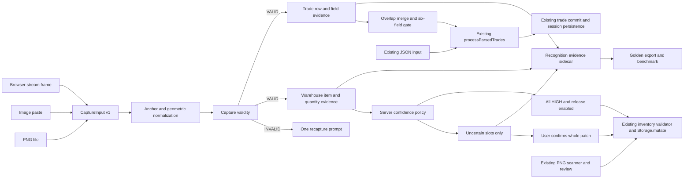
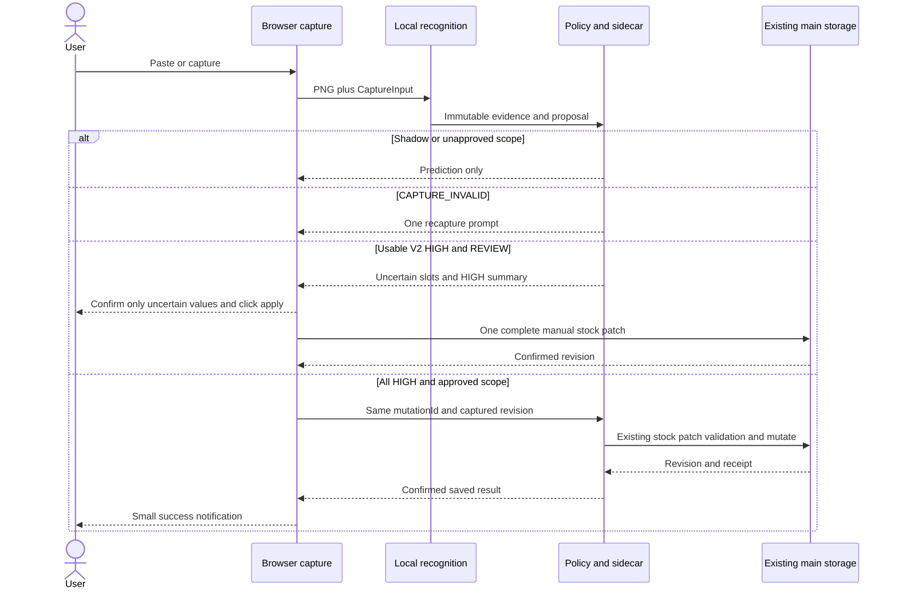

# Implementation Plan — Architecture and Decisions

## 결정 기록

| 결정 | 선택 | 이유 / 재결정 조건 |
|---|---|---|
| ADR01 | File + clipboard + browser stream hybrid | 현재 browser UI를 유지하면서 설치 dependency 없이 입력을 줄임 |
| ADR02 | Native capture production 제외 | launcher에 capture bridge 없음; WGC/Direct3D/WinRT, DPI/게임 검증 비용이 큼 |
| ADR03 | 실사용 창고 V1을 frozen R0로 보존 | false acceptance와 정답 REVIEW의 원인을 비교해 필요한 부분만 개선 |
| ADR04 | NumPy/Pillow deterministic candidates 우선 | 기존 runtime 재사용; 새 ML/OCR 채택은 측정 전 보류 |
| ADR05 | item과 quantity를 별도 recognizer로 평가 | 실제 피드백의 item 175 exact와 quantity 오류가 다른 subsystem임 |
| ADR06 | 정책은 다중 gate와 empirical risk frontier | V1 MATCH/raw score를 확률 또는 HIGH로 바꾸지 않음 |
| ADR07 | 예외만 확인 후 사용자 whole-patch 적용이 첫 usable V2 | HIGH는 세부 검수 생략; REVIEW 완료 전 전체 patch hold, 자동 적용 gate는 별도 |
| ADR08 | trade는 canonical DTO upstream adapter | processParsedTrades, review, invalidation, persistence를 재사용 |
| ADR09 | main schema 3 유지 + recognition sidecar | profile/flags/results/verified label 확장을 fixed settings/session에 섞지 않음 |
| ADR10 | remote fallback OFF / 이번 릴리스 제외 | Gemini 제거, 외부 비용/개인 화면 전송, 미측정 개선 이득 |
| ADR11 | Phase0 설계 READY, usable V2와 full auto gate 분리 | auto gate 미완료가 예외 검수 milestone과 Trade 실험을 막지 않음; 미측정 결정은 Sol artifact 필요 |

## Architecture

기존 `/api/warehouse-scan`의 response와 feedback contract는 유지하고, V2는 새 `/api/recognition/*` 경로로 호출한다. 표시용 decision은 기존 MATCH/UNKNOWN 의미를 따르되 자동 적용 허가는 별도의 automationDecision과 release policy로 관리한다.

## Candidate comparison

아래 정확도는 이번/역사 측정 외에는 **미측정**이다. 기대와 성능 입증을 구분한다. 위험/부하는 구현 구조에 따른 설계 평가다.

### Capture

| 후보 | 정확도 영향 | 개발/운영 위험 | runtime/package | 실패 형태 | 테스트/결정 |
|---|---|---|---|---|---|
| File only | 원본 PNG 보존 | 낮음, 사용자 저장 필요 | 현행 | 잘못 자른 화면 | 기존 fixture; fallback 유지 |
| Clipboard | lossless 입력 가능 | 브라우저가 제공하는 MIME/초점 | JS만 | clipboard에 image 없음 | paste 계약+실사; 채택 |
| getDisplayMedia | frame 크기·anchor 검증 필요 | 권한/세션종료/검은 frame | stream CPU; package 증가 없음 | occlusion, window minimize | permission/resize/DPI 실사; 채택 |
| Native WGC | 잠재 개선 미측정 | WinRT/Direct3D/장치/게임 호환 | 새 bridge/binary 필요 | protected surface/black frame | Windows별 실사 부담; 보류 |
| Hybrid | 동일 normalization으로 비교 | context 분기 명확화 필요 | JS+현행 CV | 혼동된 task source | 3 입력 동일 fixture 비교; 최종안 |

### Warehouse item

| 후보 | 측정/정확도 | 위험/부하/package | 유지보수/실패 | 선택 |
|---|---|---|---|---|
| Current | fixture105 top1 exact; sparse175 labels exact | 현행 NumPy/Pillow | fixed geometry, 일반품 OOD, 유사 seed abstain | baseline 재사용 |
| normalized template/NCC | 미측정 | 낮음; NumPy/Pillow만 | highlight·scale·배경 변화 | V2 비교 실험 |
| pHash | 기존 similarity 자료는 reference간 조사값 | 낮음; DCT NumPy | 색/세부정보 소실, 유사 icon 충돌 | 독립 보조, 단독 HIGH 금지 |
| feature matching | 미측정 | 작은 43px icon feature 부족; OpenCV 추가 위험 | feature 없는 icon | 후순위, production 제외 |
| lightweight classifier/embedding | 미측정 | 라벨/학습 split/NPZ 또는 runtime 추가 | OOD, leakage, 과적합 | cheap CV가 실패할 때 Sol 재설계 |
| CNN/MobileNet | 미측정 | binary/dependency/재현성 비용 큼 | label 부족 | 이번 initial release 제외 |
| ensemble | 실제 개선 미측정 | 각 reader 오류 상관 조사 필요 | 두 reader의 동시 오답 | dual agreement 후보, benchmark 후 policy 채택 |

### Quantity

| 후보 | 정확도 | 비용/실패/테스트 | 결정 |
|---|---|---|---|
| current fixed cells | fixture105 exact; human163 중11unknown/7wrong | cheap; crop/font/5자리 한계 | baseline만 |
| segmentation + template | 미측정 | NumPy/Pillow; merged/split digit, crop clipping | V2 첫 실험; token 완전성 gate |
| general Korean OCR | 과거 trade small digits 취약 | framework 크기에 비해 수량용 이득 미입증 | warehouse에 도입하지 않음 |
| small digit classifier | 미측정 | human digit label/0~9 coverage/ONNX 등 비용 | template ensemble 실패 시 새 결정 필요 |
| ensemble | 미측정 | 동일 crop/label을 공유하면 독립성 낮음 | 두 crop 정의/segmentation의 disagreement는 REVIEW |

### Trade and deployment options

| 후보 | 정확도/역사 | 부하/package/실패 | 결정 |
|---|---|---|---|
| unrestricted OCR | small req/yield exact 낮음 | 사전 없이 환각적 보정/ellipsis | 최종값으로 사용 금지 |
| OCR + constrained dictionary | 기존80행 row exact0, text는 일부 가능 | 수량이 bottleneck; fuzzy ambiguity | interface 채택, engine selection BLOCKED |
| local vision model | 미측정 | 큰 모델/CPU/package | benchmark 근거 전 production 제외 |
| remote vision | 이번 측정 없음 | 비용/장애/전송/비결정성 | 평가 설계만; 호출·통합 없음 |
| local-first hybrid | uncertain field를 hold | shadow와 기존 JSON이 즉시 fallback | 최종 architecture; HIGH engine 미확정 |

Option1 local deterministic, Option2 local lightweight ML, Option3 local + remote uncertain-crop를 같은 golden으로 비교하도록 benchmark 결과 schema를 정한다. 현재 선택은 Option1 중심; Option2는 experiment gate 후, Option3는 explicit future policy가 생길 때만 별도 설계한다. 속도/false-positive/coverage/CPU/RAM/size/offline/API cost/outage/privacy/determinism 항목을 전부 결과 표에 두고 미실행은 null로 남긴다.

## Ownership / Proposed files

창고 첫 usable milestone은 REVIEW만 확인한 후 사용자 적용으로 main 저장에 도달한다. shadow는 저장하지 않으며 full auto는 독립 승인된 후속 분기다.

기존 수정: frontend js app/api/warehouse-scan-ui/patch-review/trade-ui/persistence, frontend index/CSS, backend app.py(blueprint/종료 drain), packaging spec(새 자원), 격리 build script. 기존 main storage/contracts/session DTO는 바꾸지 않는다.

신규 production 파일은 최소 역할 단위다:

- frontend/js/capture.js: source/stream/profile frame metadata와 paste routing.
- frontend/js/recognition-ui.js: queue/shadow/exception 표시와 lifecycle.
- frontend/js/domain/recognition-adapter.js: six-field gate/merge/기존 importer adapter.
- backend/recognition_contracts.py: versioned contracts, PNG/metadata limit.
- backend/recognition_store.py: sidecar settings/profile/evidence/label/intents.
- backend/api/recognition.py: recognition/feedback/auto apply endpoint.
- backend/services/capture_normalization.py: anchor/quality/transform.
- backend/services/warehouse_recognition.py: item+quantity+policy evidence.
- backend/services/trade_recognition.py: rows/fields/candidates; engine TBD gate 필요.
- tools/recognition_dataset.py, recognition_benchmark.py, recognition_experiments.py: 실험/benchmark 전용, 제품 import 금지.
- local_app/recognition_data/: 새 승인된 anchors/profiles/policy/model-manifest. 기존 reference와 template를 수정하지 않는다.

## 공식 API 참고

getDisplayMedia 권한은 영속 재사용할 수 없고 사용자가 source를 선택한다. 개발자 hint로 BDO 창 선택을 강제하지 않는다. [W3C Screen Capture](https://www.w3.org/TR/screen-capture/).

image paste는 ClipboardEvent의 데이터로 받는다. [W3C Clipboard API](https://www.w3.org/TR/clipboard-apis/). Native WGC는 system picker와 Direct3D framepool을 요구하는 별도 경로다. [Microsoft Screen capture](https://learn.microsoft.com/en-us/windows/apps/develop/media-authoring-processing/screen-capture).

## Milestones / dependency correction

Phase0 T000 기준점 해결 + T001 provenance/R0 오확정·불필요 검수 baseline. Phase1 T002 contract/sidecar/security/**Early Evidence Store**, T003 file/clipboard, T004 stream, T005 profile. T005는 T003 파일 입력으로 개발 가능하며 T004 게임 stream 실사를 기다리지 않는다. 공통 T001/T002/T003/T005 후 Phase2A T006 warehouse replay/bench와 Phase2B T010 trade 실험이 독립적으로 가능하다. 동일 harness 파일은 병합 순서를 정해 수정하며 자동 다중 agent 실행을 지시하지 않는다.

Phase3 T007 deterministic policy/shadow/HIGH audit + T008 예외 검수·feedback·사용자 적용 = Warehouse usable V2. Phase4 T009 auto는 후속 독립 gate와 기본 OFF. Phase5 T011 trade engine freeze/holdout 이후 merge/import/session integration; T009에 의존하지 않는다. Phase6 T012 active-learning 우선순위/retention refinements. Phase7 T013 isolated package/Chrome/BDO/CPU/rollback + T014 milestone별 release 판정. usable package 검증은 T009/T011/T012 미완료여도 Warehouse 범위만으로 먼저 실행 가능하다. [tasks.md](tasks.md)가 각 작업의 세부 착수 조건 정본이다.
